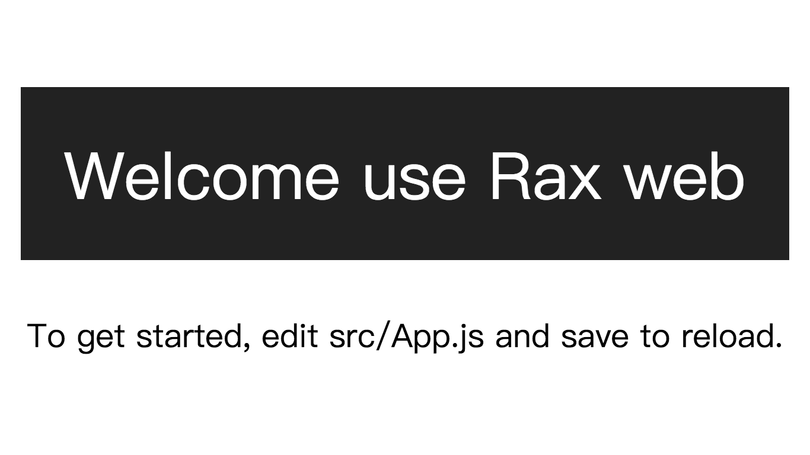

# rax-all
基于react的面向移动端和web端的工程示例，React template project for platforms!

更多参考：https://alibaba.github.io/rax/

  

## Getting Started

### `npm run start`

Runs the app in development mode.

Open [http://localhost:9999](http://localhost:9999) to view it in the browser.
Open http://localhost:9999/index.html?wh_weex=true show weex Running environment.

The page will reload if you make edits.

### `npm run lint`

You will see the lint errors in the console.

### `npm run build`

Builds the app for production to the `build` folder.
